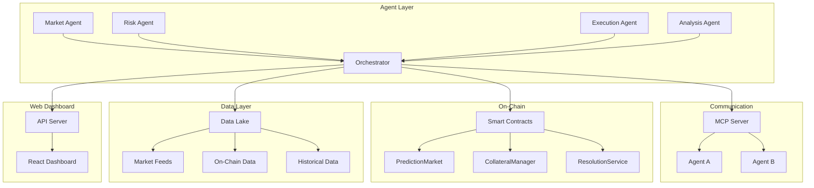

<div align="center">
  
  <p><strong>Autonomous AI Agent Framework for Prediction Markets & Decentralized Trading</strong></p>
  <p>Multi-agent coordination · On-chain settlement · MCP integration · Real-time market making</p>

  [](https://www.typescriptlang.org/)
  [](https://soliditylang.org/)
  [](https://go.dev/)
  [](LICENSE)
  [](https://github.com/Crynge/AetherAgents/actions/workflows/ci.yml)
  [](https://github.com/Crynge/AetherAgents)

</div>

---

## Table of Contents

- [Overview](#overview)
- [Architecture](#architecture)
- [Quick Start](#quick-start)
- [Agent Framework](#agent-framework)
- [Smart Contracts](#smart-contracts)
- [MCP Integration](#mcp-integration)
- [Web Dashboard](#web-dashboard)
- [Configuration](#configuration)
- [API Reference](#api-reference)
- [Deployment](#deployment)
- [Testing](#testing)
- [Contributing](#contributing)
- [License](#license)

---

## Overview

**AetherAgents** is a comprehensive framework for building, deploying, and managing autonomous AI agents that operate in decentralized prediction markets and trading environments. It combines multi-agent coordination, on-chain smart contracts, real-time market data processing, and the Model Context Protocol (MCP) for agent-to-agent communication.

Built for developers building the next generation of decentralized autonomous trading systems.

---

## Architecture



---

## Quick Start

```bash
# Clone and install
git clone https://github.com/Crynge/AetherAgents.git
cd AetherAgents

# Install dependencies
npm install

# Copy environment config
cp .env.example .env

# Start development environment
npm run dev

# Deploy contracts (local network)
npm run contracts:deploy -- --network localhost

# Start agent runtime
npm run agents:start

# Open dashboard
open http://localhost:3000
```

---

## Installation

```bash
# npm
npm install @aetheragents/core

# Go
go get github.com/Crynge/AetherAgents/go-client

# Docker
docker pull crynge/aether-agents:latest
```

---

## Agent Framework

### Creating an Agent

```typescript
import { Agent, MarketStrategy } from '@aetheragents/core';

const agent = new Agent({
  name: 'ArbitrageBot-1',
  strategy: MarketStrategy.ARBITRAGE,
  config: {
    minProfitPercent: 0.5,
    maxExposure: 10000,
    markets: ['football-premier-league', 'crypto-btc-usd'],
  },
});

agent.on('opportunity', async (opportunity) => {
  console.log(`Found opportunity: ${opportunity.type}`);
  await agent.execute(opportunity);
});

await agent.start();
```

### Agent Types

| Type | Description | Strategy |
|------|-------------|----------|
| `MarketMaker` | Provides liquidity | `LIQUIDITY_PROVISION` |
| `ArbitrageBot` | Cross-market arbitrage | `ARBITRAGE` |
| `RiskManager` | Portfolio hedging | `RISK_MANAGEMENT` |
| `SentimentAnalyst` | Sentiment-based trading | `SENTIMENT` |
| `ExecutionAgent` | Order execution optimization | `EXECUTION` |

---

## Smart Contracts

```solidity
// contracts/PredictionMarket.sol
pragma solidity ^0.8.26;

contract PredictionMarket {
    struct Market {
        string question;
        uint256 closeTime;
        uint256 resolveTime;
        bool resolved;
        uint256 yesShares;
        uint256 noShares;
    }

    mapping(uint256 => Market) public markets;
    uint256 public marketCount;

    event MarketCreated(uint256 indexed id, string question);
    event PositionTaken(uint256 indexed market, address trader, bool outcome, uint256 amount);

    function createMarket(string calldata question, uint256 closeTime) external {
        markets[marketCount] = Market({
            question: question,
            closeTime: closeTime,
            resolveTime: 0,
            resolved: false,
            yesShares: 0,
            noShares: 0
        });
        emit MarketCreated(marketCount, question);
        marketCount++;
    }

    function takePosition(uint256 marketId, bool outcome) external payable {
        Market storage market = markets[marketId];
        require(block.timestamp < market.closeTime, "Market closed");
        require(msg.value > 0, "Must send value");

        if (outcome) {
            market.yesShares += msg.value;
        } else {
            market.noShares += msg.value;
        }

        emit PositionTaken(marketId, msg.sender, outcome, msg.value);
    }
}
```

Deployed contracts are verified on Etherscan/OKLink.

---

## MCP Integration

AetherAgents implements the Model Context Protocol for agent-to-agent communication:

```typescript
import { MCPServer } from '@aetheragents/mcp';

const server = new MCPServer({
  tools: [
    {
      name: 'create_market',
      description: 'Create a new prediction market',
      parameters: {
        question: { type: 'string', required: true },
        closeTime: { type: 'number', required: true },
      },
    },
    {
      name: 'analyze_sentiment',
      description: 'Analyze market sentiment',
      parameters: {
        marketId: { type: 'string', required: true },
      },
    },
  ],
});

server.start(8080);
```

---

## Web Dashboard

The AetherAgents Dashboard provides:
- Real-time market data and price feeds
- Agent performance metrics and P&L tracking
- Smart contract interaction UI
- Agent configuration management
- Alerting and notifications

---

## Configuration

```yaml
# config/default.yaml
agents:
  maxAgents: 10
  heartbeatIntervalMs: 5000
  defaultGas: 200000

markets:
  supported: ["crypto", "sports", "politics"]
  refreshIntervalMs: 1000

contracts:
  predictionMarket: "0x..."
  collateralManager: "0x..."
  resolutionService: "0x..."

networks:
  localhost:
    chainId: 31337
    rpc: http://localhost:8545
  xlayer:
    chainId: 196
    rpc: https://xlayer.rpc.url
```

---

## API Reference

```bash
GET  /api/v1/agents           # List all agents
POST /api/v1/agents           # Create an agent
GET  /api/v1/agents/:id       # Get agent details
POST /api/v1/agents/:id/start # Start an agent
POST /api/v1/agents/:id/stop  # Stop an agent
GET  /api/v1/markets          # List markets
POST /api/v1/markets          # Create a market
GET  /api/v1/analytics        # Get performance analytics
```

---

## Testing

```bash
# TypeScript tests
npm test

# Solidity tests (Foundry)
npm run contracts:test

# Go tests
cd go-client && go test ./...

# E2E tests
npm run test:e2e
```

---

## Contributing

See [CONTRIBUTING.md](CONTRIBUTING.md).

---

## License

MIT License — see [LICENSE](LICENSE).

---

<div align="center">
  <p>Built for the decentralized AI agent ecosystem</p>
  <p>
    <a href="https://github.com/Crynge/AetherAgents/issues">Report Bug</a> ·
    <a href="https://github.com/Crynge/AetherAgents/discussions">Discussions</a>
  </p>
</div>
