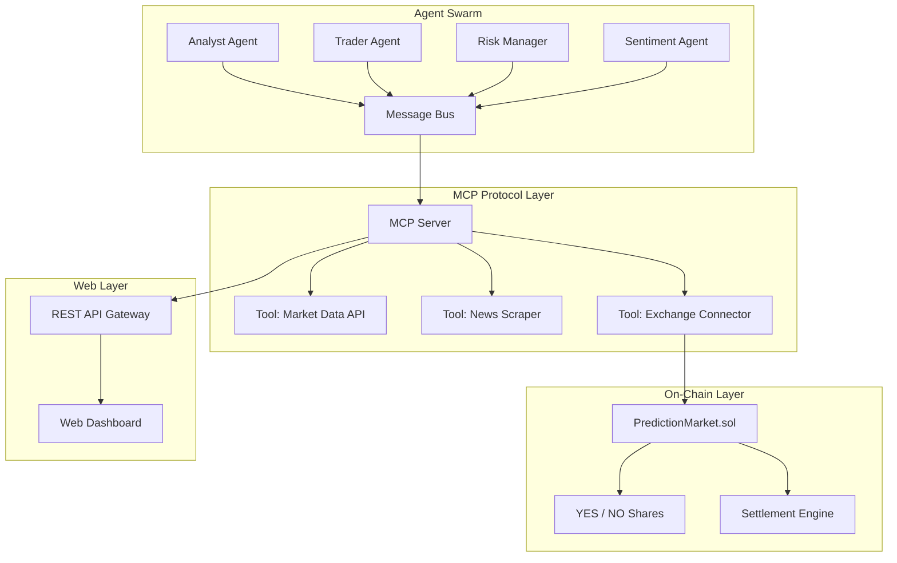

<div align="center">

# 🤖 AetherAgents

**Autonomous AI agents for prediction markets and decentralized trading** — deploy swarms of LLM-powered agents that research markets, analyze sentiment, execute trades, and settle on-chain via Solidity smart contracts.

[](https://github.com/Crynge/AetherAgents/actions/workflows/ci.yml)
[](https://typescriptlang.org)
[](https://soliditylang.org)
[](LICENSE)
[](https://github.com/Crynge/AetherAgents)
[](https://github.com/Crynge/AetherAgents/commits/main)

[Features](#features) • [Quick Start](#quick-start) • [Architecture](#architecture) • [Smart Contract](#-smart-contract) • [Modules](#modules) • [Contributing](#contributing)

---

> **⭐ Building with AI agents?** Star AetherAgents to support decentralized agent development!

</div>

---

## Features

| Capability | Description | Why It Matters |
|---|---|---|
| **Autonomous agents** | **Goal-oriented AI agents** that plan, reason, and execute trades | 24/7 market participation without human oversight |
| **MCP integration** | **Model Context Protocol** for standardized tool calling | Swap LLMs (GPT, Claude, Gemini) without code changes |
| **Smart contracts** | **Solidity prediction market** with on-chain settlement | Funds are trustless and verifiable |
| **Portfolio management** | **Risk-aware** position sizing and rebalancing | Kelly criterion + VaR limits |
| **Market analysis** | Real-time **sentiment scoring** and volatility estimation | Multi-source data aggregation |
| **Agent coordination** | Inter-agent communication via **shared memory bus** | Collaborative decision-making |

---

## Quick Start

```bash
npm install @crynge/aether-agents

# Start an agent swarm for a prediction market
npx aether-agents start --config agents.yaml

# Deploy the prediction market contract
npx aether-agents deploy --market "Will BTC hit $150K by Dec 2026?"
```

```typescript
import { AgentSwarm } from '@crynge/aether-agents/agent';

const swarm = new AgentSwarm({
  agents: [
    { role: 'analyst', model: 'gpt-4', tools: ['market-data', 'news-sentiment'] },
    { role: 'trader', model: 'gpt-4', tools: ['execute-trade', 'position-size'] },
    { role: 'risk-manager', model: 'claude-3', tools: ['risk-check', 'vaR'] },
  ],
  capital: 10000,
  riskLimit: 0.02,  // Max 2% per trade
});

await swarm.start({
  market: 'Will candidate X win the 2026 election?',
  confidence: 0.65,     // Minimum confidence to trade
});
```

---

## Architecture



---

## 📜 Smart Contract

```solidity
// SPDX-License-Identifier: MIT
pragma solidity ^0.8.0;

contract PredictionMarket {
    struct Market {
        string question;
        uint256 yesPool;
        uint256 noPool;
        uint256 expiry;
        bool resolved;
        bool outcome; // true = YES, false = NO
    }

    mapping(uint256 => Market) public markets;
    mapping(address => mapping(uint256 => mapping(bool => uint256))) public shares;

    event Trade(
        address indexed trader,
        uint256 indexed marketId,
        bool side,       // true = YES, false = NO
        uint256 amount,
        uint256 price
    );

    /// @notice Trade on a prediction market
    function trade(uint256 marketId, bool side, uint256 amount) external {
        Market storage m = markets[marketId];
        require(block.timestamp < m.expiry, "Market expired");
        uint256 price = _getPrice(m.yesPool, m.noPool);
        shares[msg.sender][marketId][side] += amount;
        if (side) m.yesPool += amount;
        else m.noPool += amount;
        emit Trade(msg.sender, marketId, side, amount, price);
    }

    /// @notice Settle market and distribute winnings
    function settle(uint256 marketId, bool outcome) external {
        Market storage m = markets[marketId];
        require(!m.resolved, "Already resolved");
        m.resolved = true;
        m.outcome = outcome;
        // Payout logic...
    }

    function _getPrice(uint256 yesPool, uint256 noPool) internal pure returns (uint256) {
        if (yesPool + noPool == 0) return 0.5 ether; // 50/50 initial
        return (yesPool * 1 ether) / (yesPool + noPool);
    }
}
```

---

## Modules

```
src/
├── agent/
│   ├── core.ts              # Agent runtime and planning loop
│   └── runtime.ts           # Tool execution + memory management
├── mcp/
│   └── server.ts            # Model Context Protocol server
├── web/
│   └── server.ts            # REST API + Web dashboard
└── contracts/
    └── PredictionMarket.sol  # Solidity prediction market
```

---

## Contributing

See [CONTRIBUTING.md](CONTRIBUTING.md) for guidelines.

- [Open an issue](https://github.com/Crynge/AetherAgents/issues)
- [Start a discussion](https://github.com/Crynge/AetherAgents/discussions)

---

## License

[MIT](LICENSE)

---

## 🌐 Crynge Ecosystem

All repos are **free and open-source**. ⭐ Star what you use!

| Category | Repos |
|---|---|
| **LLM & AI** | [SpecInferKit](https://github.com/Crynge/SpecInferKit) · [AetherAgents](https://github.com/Crynge/AetherAgents) · [PromptShield](https://github.com/Crynge/PromptShield) |
| **Marketing** | [AdVerify](https://github.com/Crynge/AdVerify) · [Attributor](https://github.com/Crynge/Attributor) · [InfluencerHub](https://github.com/Crynge/InfluencerHub) · [EdgePersona](https://github.com/Crynge/EdgePersona) · [AdVantage](https://github.com/Crynge/AdVantage) · [BrandMuse](https://github.com/Crynge/BrandMuse) · [CampaignForge](https://github.com/Crynge/CampaignForge) |
| **Simulation** | [CivSim](https://github.com/Crynge/CivSim) · [EvalScope](https://github.com/Crynge/EvalScope) |
| **Operations** | [OpsFlow](https://github.com/Crynge/OpsFlow) |

<div align="center">
  <sub>Built by <a href="https://github.com/Crynge">Crynge</a> · ⭐ Star us on GitHub!</sub>
</div>
